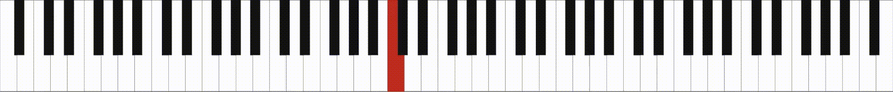

# midi2video
convert midi file to piano video with highlighted keys  



in case you create videos with piano learning/howto this one might be useful for you. Simply record your playing to a midi-file and use this little script to create footage that you can use in your video editor.

# requirements
- python3
- mydy `pip install mydy`
- cairosvg `pip install cairosvg`
- ffmpeg
- fluidsynth + soundfont-fluid *(**optional** when audio should be generated as well)*

# configuration options
create a file named `m2v.local.conf` and override any defaults...  
```ini
[video]
; resolution [pixel]
width = 800
height = 100

frameRate = 25

; add audio requires fluidsynth and a soundfont-file (e.g. soundfont-fluid)
addAudio = 0
soundFont = /usr/share/soundfonts/FluidR3_GM.sf2

[piano]
; "auto" will use the lowest note of the midi file as first key
startNote = auto
; "auto" will use the highest note of the midi file as last key
endNote = auto


colorWhiteKeys = #FFFFFF
colorBlackKeys = #131313
colorHighlight = #DE4439
outlineColorWhiteKeys = #131313
outlineColorBlackKeys = #131313
outlineColorHighlight = #6e160f


; TODO specify bin paths to make this script windows compatible
;[general]
;bin.ffmpeg = ffmpeg
;bin.fluidsynth = fluidsynth
;logLevel = info
```
# usage
`$ ./midi2video.py -i example.mid`  
will create a file `example.mid.mp4`